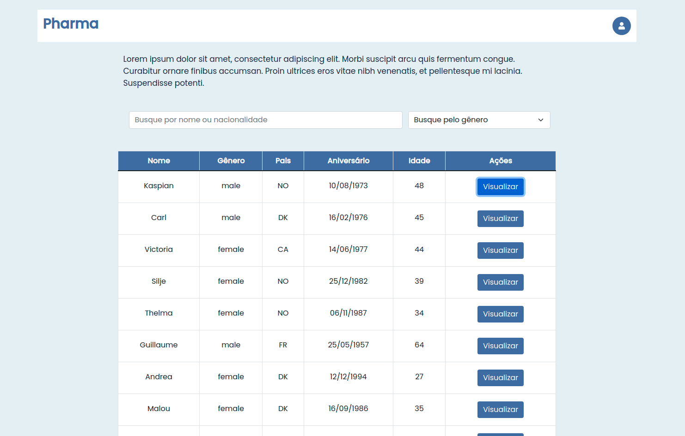
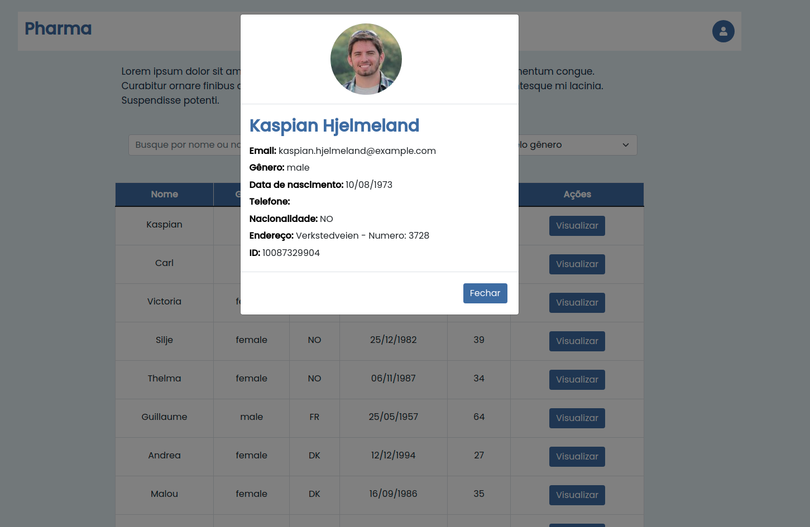

# Coodesh Pharma

## Descrição do projeto
A empresa Pharma Inc, está trabalhando em um projeto em colaboração com sua base de clientes para facilitar a gestão e visualização da informação dos seus pacientes de maneira simples e objetiva em um Dashboard onde podem listar, filtrar e expandir os dados disponíveis.

Este projeto é um desafio by [Coodesh](https://coodesh.com/);

The company Pharma Inc, is working on a project in collaboration with its customer base to facilitate the management and visualization of information from its patients in a simple and objective way in a Dashboard where they can list, filter and expand the available data.

This is a front-end challenge by Coodesh.

## Tecnologias utilizadas
- Javascript
- React.js
- Bootstrap 
- Fecth

## Como configurar e utilziar o projeto em sua máquina
- Clonar este repositório
- Na pasta onde foi clonado, execute o comando `npm i` para instalar as dependências do projeto
- Em seguida, execute o comando `npm start` para iniciar o projeto
- O projeto iniciará na porta: `http://localhost:3000` 

## Imagens do projeto

